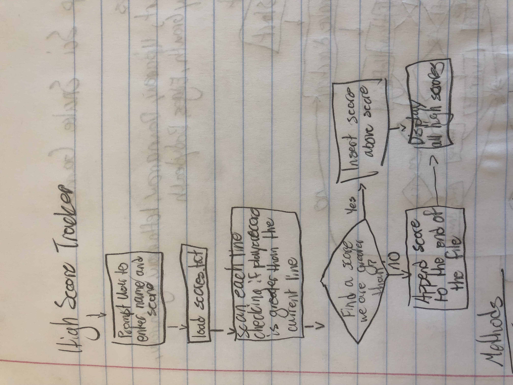
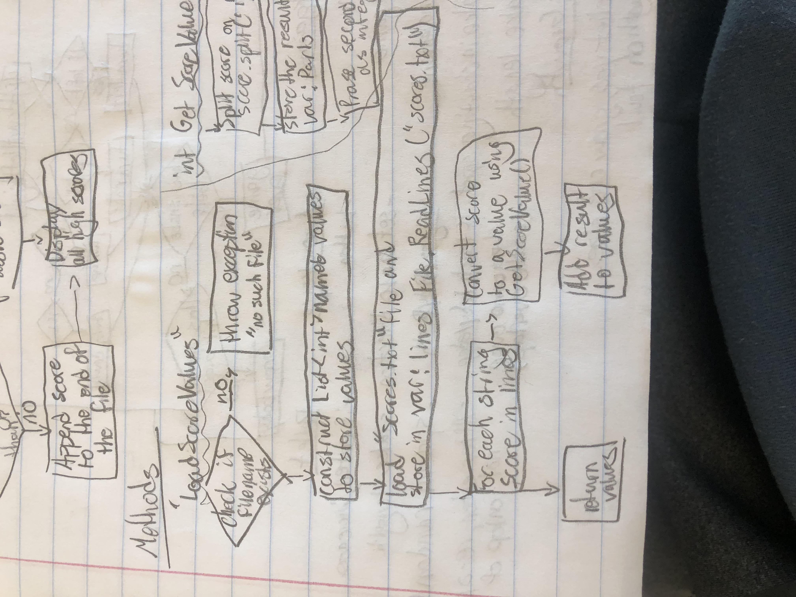
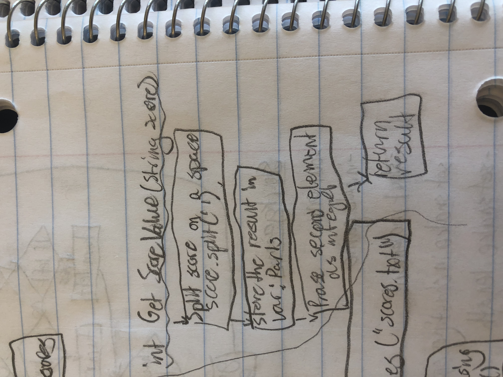
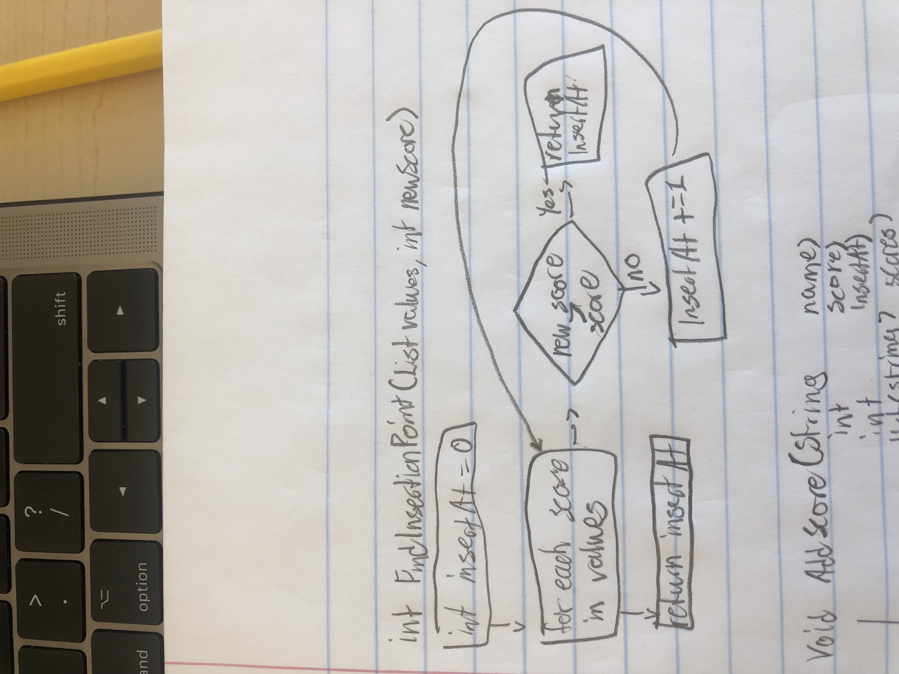
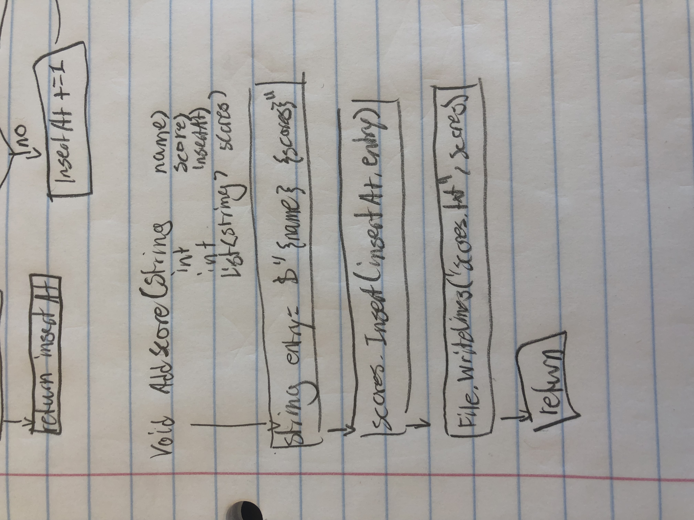

# HighScoreTracker

Overview: The purpose of High Score Tracker is to keep a record of high scores for a game. The player enters their name and score using the keyboard. The player's score is then added in the correct location in the high score list. Finally, the updated high score list is output to the console.

Flowchart:

Methods:

static List<int> LoadScoreValues(string filename);
The scores.txt file is stored in two columns. The first column is the players name and the second column is the players score. This method loads the file and extracts the second column into a List<int>.

static int GetScoreValue(string score);
This is a helper method which, given a score string of the format "name score", extracts the score value from the second column, parses it into an int value, and finally returns it.

static int FindInsertionPoint(List<int> values, int newScore);
Given a list of score values and a newScore to insert into the high scores table, returns the index where the new score should be inserted.

static void AddScore(String name, int score, int insertAt, List<String> scores);
Given the name, score, insertion location, and a list of strings containing the current high scores, inserts the name and score at the specified location. Then writes the results to "scores.txt".

